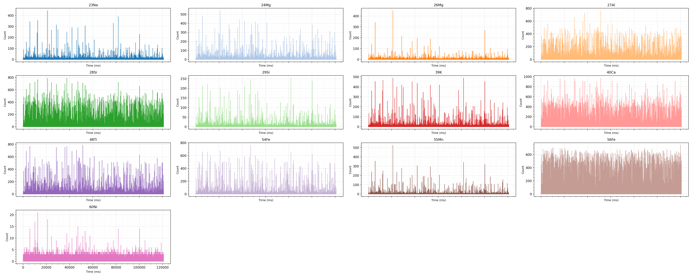

## spICP-ToF-MS Isotopes burst & NP Detection 

The Goal is to create an end-to-end pipeline for NP Prediction from the spICP-ToF-MS isotopes dataset. [Full Proposal](https://db.masteriasd.eu/internships/topic?id=704)


## Supervisors

- **Mickael Tharaud**  
- **Paul Boniol**


### Repo Structure: 
```bash
data/
├── Individual_Isotops_plot.png  - Raw Data Graph
├── NPs_BHVO_Oct23_full.csv      - Raw Data
├── __init__.py                  - Module
├── data_analysis.py             - Inspecting the dataset structure
└── graph.py                     - Plotting functions
```
### Data Analysis 


*Time‐series of ion counts for all monitored isotopes (<sup>23</sup>Na, <sup>24</sup>Mg, <sup>26</sup>Mg, <sup>27</sup>Al, <sup>28</sup>Si, <sup>29</sup>Si, <sup>39</sup>K, <sup>40</sup>Ca, <sup>48</sup>Ti, <sup>54</sup>Fe, <sup>55</sup>Mn, <sup>56</sup>Fe, <sup>60</sup>Ni) w.r.t. timestamp. Each subplot corresponds to one isotope channel.*
