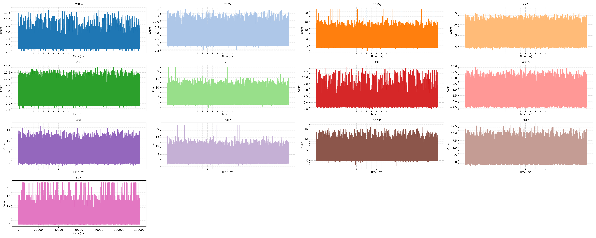
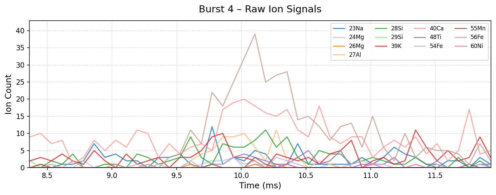
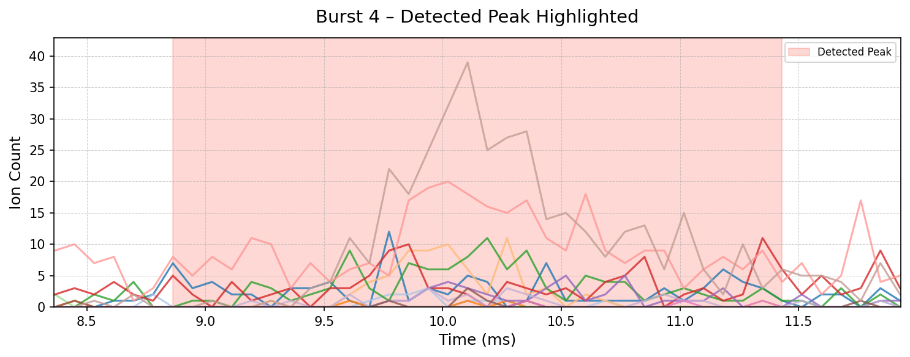
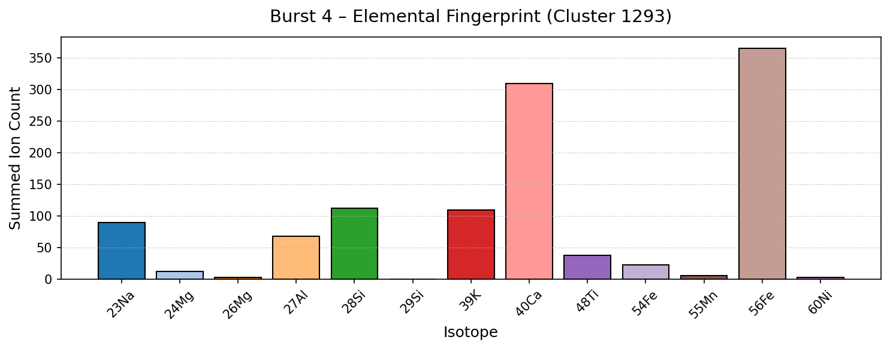

## spICP-ToF-MS Isotopes burst & NP Detection 

The Goal is to create an end-to-end pipeline for NP Prediction from the spICP-ToF-MS isotopes dataset. [Full Proposal](https://db.masteriasd.eu/internships/topic?id=704)


## Supervisors

> **Dr. Mickael Tharaud** | Université Paris Cité, IPGP \
> **Dr. Paul Boniol** | Inria, ENS, PSL Université

> ### [Latex Report](https://www.overleaf.com/read/snbfytpjrshj#b059d4)

### Repo Structure: 
```bash
data/
├── Individual_Isotops_plot.png              - Raw Data Graph
├── NPs_BHVO_Oct23_full.csv                  - Raw Data
├── __init__.py                              - Module
├── data_analysis.py                         - Inspecting the dataset structure
└── graph.py                                 - Plotting functions

models/
├── processed_data/
│   ├── burst_clusters.csv                   - Processed Clusters
│   └── detected_bursts.csv                  - Detected Peaks: every window
├── results/
│   ├── burst_4_cluster.png
│   ├── burst_4_original.png
│   └── burst_4_peak.png
├── Norm_Individual_Isotops_plot.png         - Norm Data Graph
├── __init__.py                              - Module
├── autoencoder_1d_cnn.py                    - Autoencoder Architecture
├── autoencoder_main.py                      - Main Function
├── cluster_bursts.py                        - Clustering hdbscan
├── preprocess_ts.py                         - Savgol Filter
├── test.py
└── visualize_sample_burst.py                - Plots: small window

thresholding_techniques/
├── processed_data/
│   ├── isolation_forest_bursts.csv          - Processed Data
│   └── mahalanobis_bursts.csv               - Processed Data
├── results/
│   ├── isolation_forest_bursts.png          - Peak Plot
│   ├── mahalanobis_bursts.png               - Peak Plot
│   ├── peaks_23Na.pkl                       - 23Na Processed data
│   ├── peaks_23Na_panels.png                - 23Na Plot 
│   └── … (other result files)
├── assign_particles_all.py                  
├── isolation_forest_detection.py            - Isolation Forest Algo
├── mahalanobis_detection.py                 - Mahalanobis Algo
└── peak_utils.py                            - Univariate (Otsu’s, Quantile, Rolling, Sigma etc..)

```

### Data Analysis 


*Time‐series of ion counts for all monitored isotopes (<sup>23</sup>Na, <sup>24</sup>Mg, <sup>26</sup>Mg, <sup>27</sup>Al, <sup>28</sup>Si, <sup>29</sup>Si, <sup>39</sup>K, <sup>40</sup>Ca, <sup>48</sup>Ti, <sup>54</sup>Fe, <sup>55</sup>Mn, <sup>56</sup>Fe, <sup>60</sup>Ni) w.r.t. timestamp. Each subplot corresponds to one isotope channel.*


### Pre-processing 
#### Savitzky–Golay Filter + Residual Correction


*Figure 2: Normalized residuals r(t) for each isotope channel after Sav-
itzky–Golay smoothing and rolling-window baseline removal. Each subplot
shows r(t) versus time for one isotope.*

***Note**: Visually, the original graphs might look easier to detect peaks, but the goal is to process the data as a multivariate timeseries. This filter helps to even the scale among the Isotopes while preserving peaks.*

***Goal**: Since it is unsupervised, it is possible to train an autoencoder latent space to mimic the noise (Peaks are hard to learn). Then, reconstruct the noise from the latent representation and compare with the original data to check for reconstruction error. Finally, we can extract the windows with high error (Peaks).*

### Model architecture 
```bash 
| Layer               | Parameters                                                             |
|---------------------|------------------------------------------------------------------------|
| **Input**           | shape=(window_size, n_channels)                                        |
| **Encoder**         |                                                                        |
| Conv1D              | filters=32, kernel_size=3, activation='relu', padding='same'           |
| MaxPooling1D        | pool_size=2, padding='same'                                            |
| Conv1D              | filters=16, kernel_size=3, activation='relu', padding='same'           |
| MaxPooling1D        | pool_size=2, padding='same'                                            |
| **Decoder**         |                                                                        |
| Conv1D              | filters=16, kernel_size=3, activation='relu', padding='same'           |
| UpSampling1D        | size=2                                                                 |
| Conv1D              | filters=32, kernel_size=3, activation='relu', padding='same'           |
| UpSampling1D        | size=2                                                                 |
| **Output**          |                                                                        |
| Conv1D              | filters=n_channels, kernel_size=3, activation='linear', padding='same' |
```

### Results for a small window
<p float="center">
  
  
</p>

<p align="center">
  
</p>


